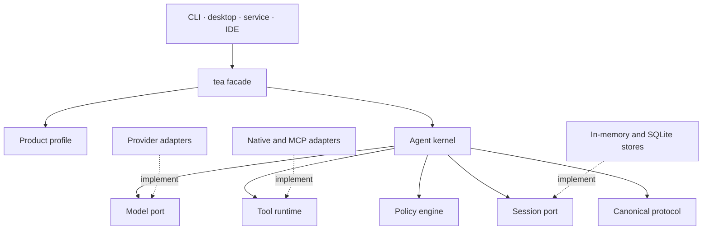
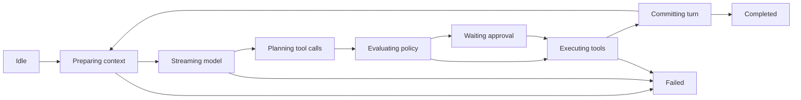

Tea owns agent semantics while treating model providers, tools,
persistence, policy, and user interfaces as replaceable adapters. It is not a
chat UI library, an LLM HTTP client, or a coding-agent product — those can be
built on top of it.

## Design lineage

Tea's agent architecture is inspired by [Pi](https://pi.dev/docs/latest/sdk): a
small session API, a provider-independent agent loop, replaceable provider and
tool adapters, and one engine beneath multiple product surfaces. Tea adds its
own Rust contracts for durable approvals, append-only sessions, policy, and
canonical commands and events.

The terminal interaction is inspired by the
[OpenAI Codex](https://github.com/openai/codex) TUI: semantic timeline cells, a
stable bottom composer, compact tool lifecycle rows, follow-tail scrolling, and
focused approval overlays.

Tea is an independent implementation. It does not claim source, API, wire, or
product compatibility with either reference.

## Layers

Dependencies point inward. Inner crates never depend on a UI framework, a
specific model provider, terminal UI types, or MCP/plugin implementation
details. Product behavior is composed through profiles rather than
product-specific branches in the kernel.

## Canonical protocol

Product surfaces communicate with the runtime through versioned commands and
events. Canonical serialization uses JSON with `camelCase` fields and a `type`
discriminator. Stable entity IDs are UUID v7 strings; wire timestamps are RFC
3339 UTC; authoritative session order uses a session-local sequence.

Compatibility rules differ by data role: unknown optional fields are ignored,
unknown commands are rejected, and unknown required durable records stop replay.
Provider-specific payloads never appear in stable core fields.

## Kernel state machine

The kernel is an explicit state machine rather than a recursive chat helper:

Key invariants:

- Every event has a monotonically increasing session sequence.
- Assistant messages commit before their requested tools execute.
- Tool results commit in source order, even when safe tools run concurrently.
- An in-flight provider request uses an immutable turn snapshot.
- A truncated model tool call is never executed.
- Waiting approval is persistable and recoverable.
- Non-idempotent tools are never retried automatically after an uncertain
  outcome.

## Policy and approval

Policy evaluates a validated invocation — not merely a tool name — against
actor, profile, workspace, validated arguments, declared effects, resolved
resources, environment, prior grants, and time. Decisions are `allow`, `deny`,
`ask`, or `redirect` to another execution target. Composition precedence is
`Platform -> Organization -> Product -> Workspace -> User grant`; a lower layer
may narrow permissions but cannot broaden a prior result.

Policy is not a sandbox. A native executor has the process's operating-system
permissions; strong isolation requires a separate execution target such as a
process sandbox, container, VM, or remote worker.

## Sessions and durability

The source of truth is an append-only session event log. Materialized views
(listing, transcript, statistics) are rebuildable projections, never a second
source of truth. SQLite is the first durable backend and passes the same
conformance suite as the in-memory reference store.

Recovery restarts only from durable boundaries. A tool interrupted after side
effects begin is recorded as uncertain and is never replayed automatically
unless its executor declares and implements a safe recovery strategy.

## Current scope

Tea does not include autonomous multi-agent orchestration, a plugin
marketplace, vector-database memory, browser automation, arbitrary in-process
dynamic libraries, or distributed scheduling.
