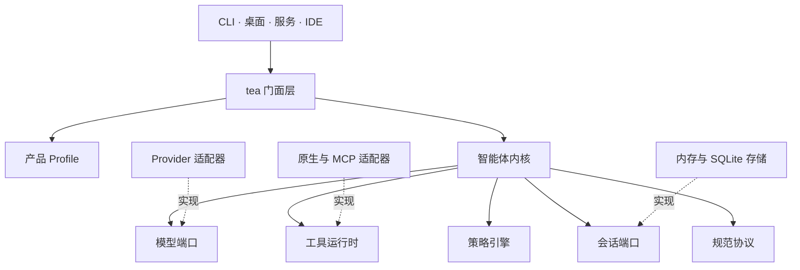
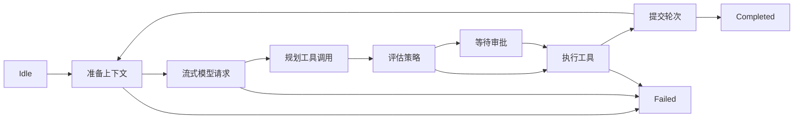

Tea 拥有智能体语义，同时将模型提供商、工具、持久化、策略与用户界面视为可替换的适配器。它
不是聊天 UI 库、LLM HTTP 客户端或编码智能体产品——这些可以构建在它之上。

## 设计来源

Tea 的智能体架构借鉴了 [Pi](https://pi.dev/docs/latest/sdk)：小型会话 API、与 Provider 无关
的智能体循环、可替换的 Provider 和工具适配器，以及多个产品层共享同一个引擎。Tea 在此基础上
定义了自己的 Rust 契约，包括持久化审批、仅追加会话、策略以及规范命令与事件。

终端交互借鉴了 [OpenAI Codex](https://github.com/openai/codex) TUI：语义化时间线 Cell、稳定
的底部编辑器、紧凑的工具生命周期行、实时跟随滚动和聚焦的审批 Overlay。

Tea 是独立实现，不声明与上述参考项目的源码、API、Wire 或产品兼容性。

## 分层

依赖向内指向。内部 crate 绝不依赖 UI 框架、特定模型提供商、终端 UI 类型或 MCP/插件实现细节。
产品行为通过配置组合，而非内核中的产品特例分支。

## 规范协议

产品层通过带版本的命令与事件与运行时通信。规范序列化使用 JSON，字段为 `camelCase`，判别符为
`type`。稳定实体 ID 为 UUID v7 字符串；线上时间戳为 RFC 3339 UTC；权威会话顺序使用会话本地序列。

兼容规则因数据角色而异：未知可选字段被忽略，未知命令被拒绝，未知的必要持久化记录会中止回放。
提供商特定的载荷绝不进入稳定的核心字段。

## 内核状态机

内核是显式状态机，而非递归式聊天助手：

关键不变式：

- 每个事件具有单调递增的会话序列号。
- 助手消息在其请求的工具执行前提交。
- 工具结果按源序提交，即使安全工具并发执行。
- 进行中的提供商请求使用不可变的轮次快照。
- 截断的模型工具调用绝不执行。
- 等待审批可持久化、可恢复。
- 非幂等工具在不确定结果后绝不自动重试。

## 策略与审批

策略评估的是已校验的调用——而不仅是工具名——依据执行者、配置、工作区、工具规格、已校验参数、
声明效应、已解析资源、先前授权、执行环境与时间。决策为 `allow`、`deny`、`ask` 或 `redirect`
到其他执行目标。组合优先级为 `Platform -> Organization -> Product -> Workspace -> User
grant`；下层可收紧权限，但不能放宽既有结果。

策略不是沙箱。原生执行器拥有进程的操作系统权限；强隔离需要单独的执行目标，如进程沙箱、容器、
虚拟机或远程工作器。

## 会话与持久化

真相来源是仅追加的会话事件日志。物化视图（列表、转录、统计）是可重建的投影，而非第二真相来源。
SQLite 是首个持久化后端，与内存引用存储通过同一一致性套件。

恢复仅从持久化边界重启。在副作用开始后被中断的工具被记录为不确定，除非其执行器声明并实现安全的
恢复策略，否则绝不自动回放。

## 当前范围

Tea 不包含自主多智能体编排、插件市场、向量数据库记忆、浏览器自动化、任意进程内动态库或
分布式调度。
